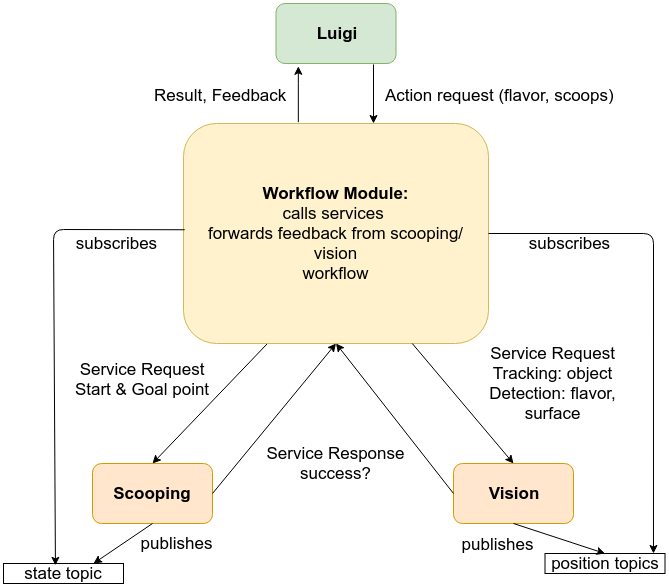

# :ice_cream: [Gelataio](https://en.wiktionary.org/wiki/gelataio) mode for [Roboy](https://roboy.org/) :ice_cream:

SS19 Full Body Control and Vision Team. We handle the vision and control parts for the ice-cream project.

| Vision Video | Final Video |
| ------------ | ----------- |
|<a href="http://www.youtube.com/watch?feature=player_embedded&v=DI6FIhWma3Y" target="_blank"></a> | <a href="http://www.youtube.com/watch?feature=player_embedded&v=F1awb4STJ84&list=PL5VpohfE5RnEzUAK9cNsspMwvD0zZquJI&index=4" target="_blank"></a> |

## Slides
- [Midterm Slides](https://docs.google.com/presentation/d/1NewMwSdnp7RwAgcC_RcqNRAtOPzeC24GHkpUbu42Q8k/edit?usp=sharing)
- [Finals Slides](https://docs.google.com/presentation/d/1lT7aWF8S_64XrxOK5uWU9qckEqH8yqs6vt6CNHx1nYM/edit#slide=id.g3ecef60b9d_0_7)
- [Sprint Sync 1](https://docs.google.com/presentation/d/12Hat28XKuapki89IOibCmz_zspT1Y5xjBFHNrMO4YSE/edit#slide=id.g3ec4627452_0_202)
- [Sprint Sync 2](https://docs.google.com/presentation/d/1Jai6Dpnfc-tcUIdtP4Eqru7uiEwxb5YKbDpsJK-65wQ/edit#slide=id.g3ecef60b9d_0_7)

## Architecture Diagram



# Run using Docker

TODO: @Stanislav

Command to build the docker: 
```bash
docker todo
```

Command to launch one of the launch files using docker:
```bash
docker todo

@Stanislav: Could you also push our docker to you docker hub. Then others can simply pull it and do not need to create and compile the docker on their own. This will make it significantly faster and easier to use our repository. Already building our container takes more than 10 mins so we wouldn't pass the "try it out for the impatient".
```

# Launch Files for Startup of all processes

We provide a set of launch files launching a couple of ROS nodes dependent on which setup you have. We distinguish real and sim environments. Real means for have roboy and the FPGA's running and have the hardware in the loop during execution. For sim environments there is no Roboy hardware and you use rviz to show the world state, e.g. you are in a simulated environment.

| Real / Simulated Environment | Luigi Available? | Launch File |
| ---------------------------- | ---------------- | ----------- |
| Real | Yes | [start_real.launch](coordinator/launch/start_real.launch) |
| Real | No (fake him) | [start_real_test.launch](coordinator/launch/start_real_test.launch)|
| Sim | Yes | [start_sim.launch](coordinator/launch/start_sim.launch)|
| Sim | No (fake hime) | [start_sim_test.launch](coordinator/launch/start_sim_test.launch)|

# Code Organization

Clone the repository into the `src` folder of your catkin workspace. Like this
```
cakin_ws/
	build/
		...
	devel/
		...
	src/
		CARDSflow/
			...
		gelatatio-boy/
			<subpackages of our project>
		<further packages if required>
```

Catkin build the packages recursively.


